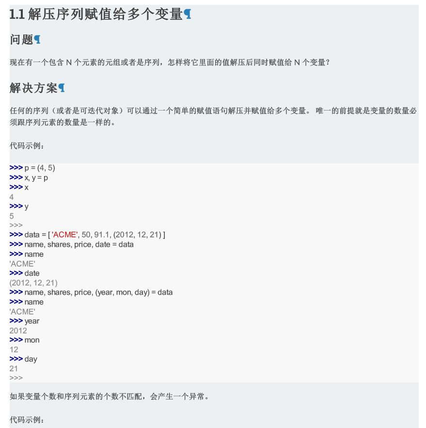

# python3_cookbook
##This projiect is used to grab the translation of 'python3-cookbook',it is a tutorial which I really favorite：[http://https://python3-cookbook.readthedocs.io/zh_CN/latest/](http://https://python3-cookbook.readthedocs.io/zh_CN/latest/ "python3 cookbook")

PS:I started with his Python tutorial

1.  This is a asynchronous crawler

2. The library used is as follows: BeautidfulSoup4, requests, pdfkit, asyncion,aiohhtp;you can `pip install [package]`

3. Use wkhtmltopdf to convert the crawled html to pdf

4. I kept the script and css styles in the html file, which makes it look like you see on the web.

3. Distributed and ip proxy pools are not used

5.  I kept the crawled html and pdf, they are in the zip file.

